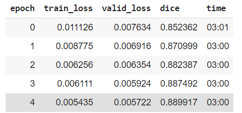
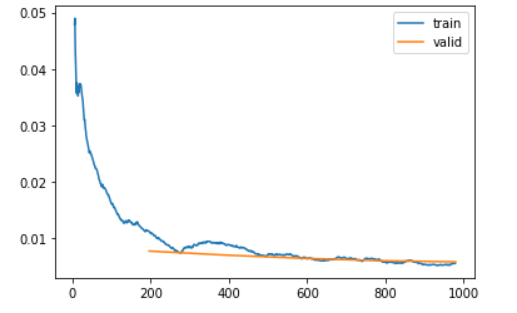
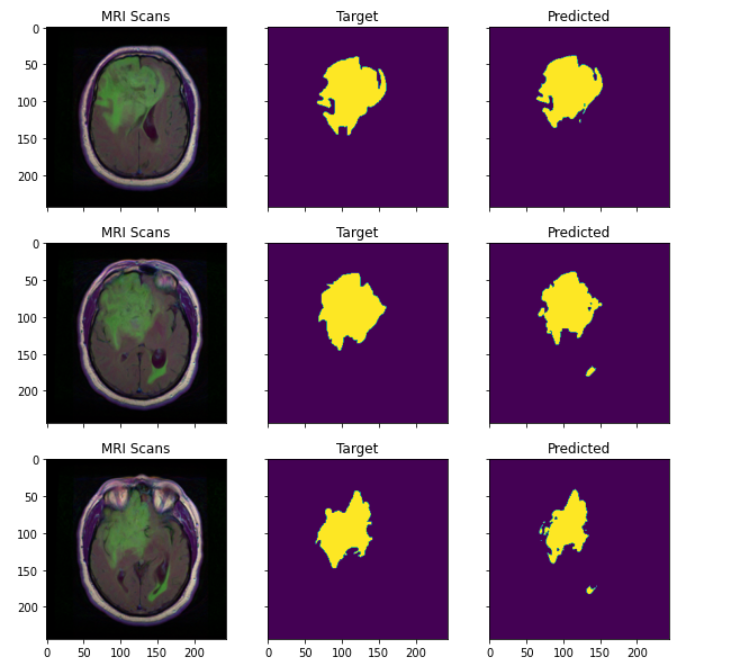

# Identifying Brain Tumor from MRI images

# (I) Objective : The objective of this project is to identify brain tumor from MRI images using FastAI's Dynamic UNet with ResNet34 as Encoder.

# (II) Dataset Used :

This dataset contains brain MR images together with manual FLAIR abnormality segmentation masks.
The images were obtained from The Cancer Imaging Archive (TCIA).
They correspond to 110 patients included in The Cancer Genome Atlas (TCGA) lower-grade glioma collection with at least fluid-attenuated inversion recovery (FLAIR) sequence and genomic cluster data available.

Link to the dataset : https://www.kaggle.com/mateuszbuda/lgg-mri-segmentation

# (III) Architecture of UNet :

### Paper introducing UNet : https://arxiv.org/abs/1505.04597

# Training Details :

### Optimizer Used : RAdam + LookAhead (ranger in FastAI Library)

#### Paper Discussing RAdam : https://arxiv.org/abs/1908.03265

#### Paper Discussing LookAhead : https://arxiv.org/abs/1907.08610

### Activation Function Used : Mish

#### Paper Discussing Mish : https://arxiv.org/abs/1908.08681

### Scheduler Used : flat + cosine annealing

### FastAI's Learning Rate Finder based on paper : https://arxiv.org/abs/1506.01186

### Training Logs :

### Bias and Variance Plot :

# Result :

